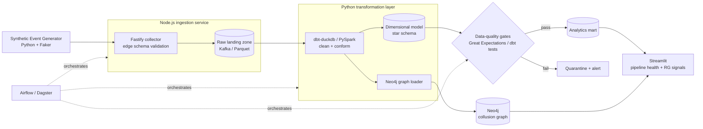

# PitBoss — Casino Player Activity & Responsible-Gaming Intelligence Pipeline

> End-to-end casino event pipeline — **Node.js** ingestion → **Python/dbt** modeling → **Neo4j** collusion detection — with contract tests and observability that catch data-quality failures *before* they reach analysts.

Named after the casino floor supervisor whose entire job is watching the pit for integrity problems and collusion. That's what this pipeline does to the data.

---

## Why this exists

Casino platforms emit a relentless stream of transactional events — wagers, wins, deposits, withdrawals, bonus claims, session activity. Two things have to be true of the data built on top of it:

1. **It has to be trustworthy.** Analysts and finance make real decisions on these numbers. A duplicated event or a silently dropped batch is a wrong revenue figure.
2. **It has to support responsible gaming.** Regulators and the business both need to detect bonus-abuse rings, linked-account collusion, and wagering after self-exclusion — patterns that are invisible in flat tables but obvious in a graph.

PitBoss is built around both. The pipeline turns a raw event firehose into analytics-ready dimensional models, and a parallel graph layer surfaces the account clusters a star schema can't see. Every stage is gated by data-quality contracts, so bad data fails loudly at the boundary instead of quietly downstream.

## Architecture



## The Node.js + Python split

This is deliberate, not decorative. Real casino platforms run Node-heavy on the real-time edge and Python-heavy on the analytics side, and the pipeline mirrors that:

| Layer | Language | Responsibility |
|-------|----------|----------------|
| Ingestion / event collector | **Node.js** (Fastify) | Receive casino events, validate schema at the edge, reject malformed payloads, write to the raw landing zone |
| Transformation & modeling | **Python** (dbt-duckdb / PySpark) | Clean, conform, build dimensional models, load the graph |
| Orchestration | **Python** (Airflow / Dagster) | Schedule, monitor, and manage the production DAG |
| Quality & observability | **Python** (Great Expectations) | Contract tests, freshness checks, anomaly detection |

The result is one pipeline that genuinely runs across both languages, wired the way a production casino stack actually is.

## Data model

A Kimball star, because casino data has real grain decisions worth documenting (a *wager* vs. a *spin* vs. a *round* are not the same event):

- `dim_player` — player attributes, registration, self-exclusion status
- `dim_game` — game type, provider, house edge
- `dim_time` — standard date/time dimension
- `fact_wager` — grain: one row per settled wager
- `fact_session` — grain: one row per play session
- `fact_bonus_claim` — grain: one row per bonus claim, linked to deposit

Grain choices and their tradeoffs are written up in [`docs/data-model.md`](docs/data-model.md).

## The graph layer (Neo4j)

Flat tables can tell you *that* ten accounts each claimed a signup bonus. Only a graph makes it obvious they're the same person.

**Nodes:** `Player`, `Device`, `PaymentInstrument`, `SessionFingerprint`
**Edges:** `SHARED_DEVICE`, `SHARED_CARD`, `REFERRED_BY`, `SAME_FINGERPRINT`

**Detection patterns implemented:**
- **Bonus-abuse rings** — clusters of "distinct" accounts sharing a payment instrument, all claiming the same promotion
- **Linked-account collusion** — accounts connected through devices/fingerprints exhibiting coordinated play
- **Referral farming** — referral chains where referrer and referee share identity signals

Cypher queries live in [`graph/queries/`](graph/queries/).

## Data quality & observability

The part most pipelines skip and this one is built around. Quality is enforced as **contracts at stage boundaries**, not hoped for downstream:

- **Referential integrity** — every `fact_wager.player_id` resolves to a real player
- **Business invariants** — no negative balances, bonus never exceeds qualifying deposit, no wagers timestamped after a self-exclusion event
- **Freshness & volume** — row-count and lateness anomaly detection on each load; deviations quarantine the batch instead of polluting the mart
- **Pipeline health panel** — a Streamlit view of freshness, test pass rates, and quarantined-batch counts

### The "bad data day"

The synthetic generator can deliberately inject failure modes — duplicate events, a schema drift, a late-arriving batch — on demand. [`docs/incident-log.md`](docs/incident-log.md) walks through each injected failure and shows the check that caught it. Investigating and resolving data-quality issues is a *demonstrated* story here, not a line on a resume.

## Tech stack

**Ingestion:** Node.js, Fastify · **Transport:** Kafka (or Parquet landing zone for the lightweight path) · **Transformation:** dbt-duckdb, PySpark · **Graph:** Neo4j · **Orchestration:** Airflow / Dagster · **Quality:** Great Expectations, dbt tests · **Observability / UI:** Streamlit · **Runtime:** Linux

## Getting started

```bash
# 1. Clone and set up
git clone https://github.com/sajansshergill/pitboss.git
cd pitboss

# 2. Python environment
python -m venv .venv && source .venv/bin/activate
pip install -r requirements.txt

# 3. Node ingestion service
cd ingest && npm install && cd ..

# 4. Start infra (Neo4j, Kafka) via Docker
docker compose up -d

# 5. Generate synthetic events (clean file sink)
python generator/emit.py --players 200 --sink file

# 6. Run the pipeline end to end
./run_pipeline.sh
# or: python orchestration/pipeline.py --players 200

# 7. Launch the dashboard
streamlit run app/dashboard.py
```

To reproduce the bad-data-day scenario:

```bash
./run_pipeline.sh --bad-day
# or: python orchestration/pipeline.py --inject duplicates,schema-drift,late-batch
```

## Project structure

```
pitboss/
├── ingest/            # Node.js Fastify event collector
├── generator/         # Python synthetic event generator (+ failure injection)
├── transform/         # dbt-duckdb models + PySpark jobs
├── graph/             # Neo4j loader + Cypher detection queries
├── quality/           # Great Expectations suites + dbt tests
├── orchestration/     # Airflow / Dagster DAG definitions
├── app/               # Streamlit health + RG dashboard
├── docs/              # data-model.md, incident-log.md, decisions.md
└── docker-compose.yml
```

## Testing

```bash
pytest                      # unit + integration tests for generator, ingest, transforms, quality, graph
python quality/contracts.py # pipeline quality gate against the local DuckDB warehouse
dbt test                    # optional production model-level contracts, with dbt-duckdb installed
```

## Scope & honest gaps

Built to demonstrate production *patterns*, not to run at production *scale*. What's deliberately simulated or simplified:

- **Data is synthetic.** A Faker-based generator emits believable casino events at a controlled rate. The goal is realistic shape and on-demand failure modes, not real volume.
- **Single-node infra.** Kafka, Neo4j, and the DAG run on one Linux VM via Docker Compose. The architecture is horizontally scalable; this deployment isn't provisioned for it.
- **Detection patterns are illustrative.** The three fraud/collusion patterns cover the common shapes; a real responsible-gaming system would tune thresholds against labeled outcomes.

These are choices, not blind spots — documented here so the tradeoffs are visible.

## Roadmap

- [ ] CDC-style incremental loads instead of full-batch
- [ ] Great Expectations → data-contract enforcement in CI
- [ ] Graph-based anomaly scoring (community detection) beyond rule-based patterns
- [ ] Backfill + replay tooling for historical reprocessing

---

**Author:** Sajan Shergill · [Portfolio](https://sajansshergill.github.io) · [LinkedIn](https://linkedin.com/in/sajanshergill)
